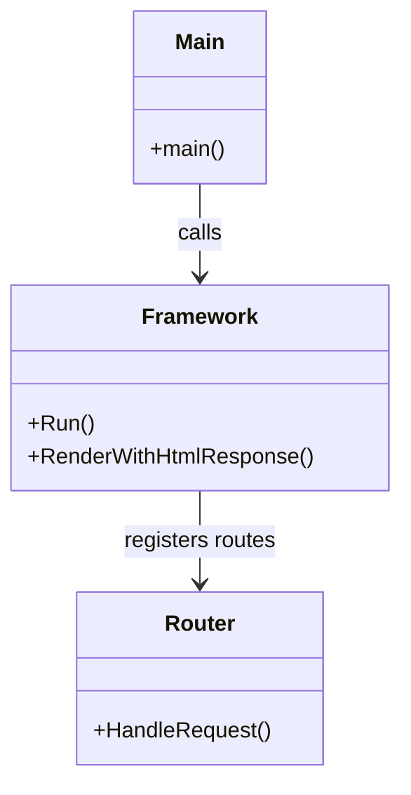
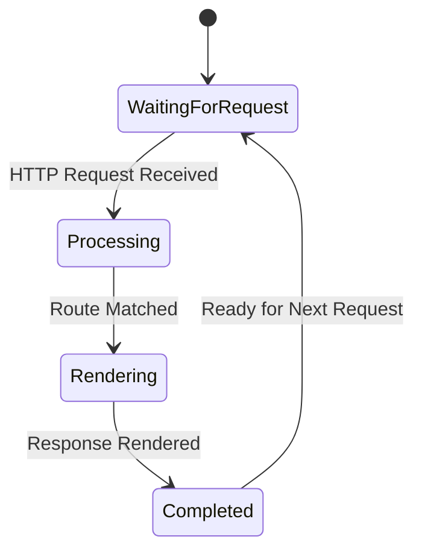

# Framework-Template Codebase Diagram

## Class Diagram

```mermaid
classDiagram
    class Main {
      +main()
    }
    class Framework {
      +Run()
      +RenderWithHtmlResponse()
    }
    class Router {
      +HandleRequest()
    }
    Main --> Framework : calls
    Framework --> Router : registers routes
```

## State Diagram

```mermaid
stateDiagram-v2
    [*] --> WaitingForRequest
    WaitingForRequest --> Processing : HTTP Request Received
    Processing --> Rendering : Route Matched
    Rendering --> Completed : Response Rendered
    Completed --> WaitingForRequest : Ready for Next Request
```

## Existing Diagrams

...existing code...
